### Automated-CI-CD-Pipeline-Integration-for-a-Django-Web-Application

This project demonstrates the implementation of a complete CI/CD (Continuous Integration and Continuous Deployment) pipeline with DevOps practices using a simple Django-based web application. While the Django application the main focus of the project lies in automating the entire software delivery lifecycle, from code commit to cloud deployment.


---

## 🚀 Live Application
🔗 **Production URL:** [https://hearty-mindfulness-production-46f0.up.railway.app/](https://hearty-mindfulness-production-46f0.up.railway.app/)

---

## 🧩 Project Overview
This repository demonstrates a **complete CI/CD pipeline** for a **Dockerized Django web application**, automated using **GitHub Actions** and deployed on **Railway (serverless cloud platform)**.  
It ensures automated build, testing, image creation, and deployment whenever a new commit is pushed to the `deployment` branch.

---

## 🧱 Features
- ✅ Continuous Integration — automated builds and testing  
- 🚀 Continuous Deployment — live updates on Railway  
- 🐳 Dockerized environment — consistency across systems  
- ⚙️ GitHub Actions automation  
- 🌐 Serverless hosting (Railway)

---

## 🐳 Docker Setup

### Build and Run Locally
```bash
# Build Docker image
docker build -t django-app .

# Run container
docker run -p 8000:8000 django-app
```

### Or Use Docker Compose

```bash
docker compose up --build
```

Access locally: **[http://localhost:8000/](http://localhost:8000/)**

---

## ⚙️ CI/CD Workflow

The GitHub Actions workflow automates:

1. Building and testing the app
2. Creating a Docker image
3. Pushing the image to Docker Hub (tagged by commit SHA)
4. Deploying to Railway

---

### 📁 `.github/workflows/deploy.yml`

```yaml
name: CI/CD Pipeline

on:
  push:
    branches:
      - main
jobs:
  build:
    runs-on: ubuntu-latest
    steps:
      - name: Checkout repository
        uses: actions/checkout@v4

      - name: Build Docker image
        run: docker build -t ankith1307/myproject:${{ github.sha }} .

      - name: Login to Docker Hub
        run: echo "${{ secrets.DOCKER_PASSWORD }}" | docker login -u "${{ secrets.DOCKER_USERNAME }}" --password-stdin

      - name: Push Docker image
        run: docker push ankith1307/myproject:${{ github.sha }}

  deploy:
    runs-on: ubuntu-latest
    needs: build
    steps:
      - name: Deploy to Railway
        uses: railwayapp/action-deploy@v1
        with:
          serviceId: ${{ secrets.RAILWAY_SERVICE_ID }}
          railwayToken: ${{ secrets.RAILWAY_TOKEN }}
```

---

## 🔐 Environment Variables

Configured via Railway Dashboard or `.env`:

```env
DJANGO_SECRET_KEY=your_secret_key
DEBUG=False
ALLOWED_HOSTS=hearty-mindfulness-production-46f0.up.railway.app
DATABASE_URL=your_database_url
```

---

## 🧪 Local Development

Run Django manually:

```bash
python manage.py makemigrations
python manage.py migrate
python manage.py runserver
```

Access locally: **[http://127.0.0.1:8000/](http://127.0.0.1:8000/)**

---

## 🧾 Deployment Notes

* Every push to `deployment` triggers a **new image build and deploy**
* Each Docker image is tagged with the **Git commit SHA** and **latest**
* Railway automatically handles scaling, SSL, and environment setup
* Live logs available on Railway dashboard

---

## 🧱 Tech Stack

| Tool               | Purpose               |
| ------------------ | --------------------- |
| **Django**         | Backend framework     |
| **Docker**         | Containerization      |
| **GitHub Actions** | CI/CD automation      |
| **Railway**        | Serverless deployment |

---

## 📊 Pipeline Flow

```mermaid
flowchart LR
    A[Code Push to GitHub] --> B[GitHub Actions Triggered]
    B --> C[Build Docker Image]
    C --> D[Push Image to Docker Hub]
    D --> E[Deploy on Railway]
    E --> F[App Live 🚀]
```




## 🧭 Future Enhancements

* Add Mointoring tools such as Grafana or loki
* Integrate Ruff + Pyright for linting and type checks
* Enable GitHub Pages for docs
* Slack notifications for build and deployment status

---

## 👨‍💻 Author

**Ankith Mohan**  
🎯 *Aspiring Python Backend Developer / DevOps Developer*  
📧 [ankithmohan1092@gmail.com](mailto:ankithmohan1092@gmail.com)  
🐙 [GitHub](https://github.com/ankith1307)

---

🛠️ *Every push builds a new Docker image and deploys automatically to Railway, ensuring continuous delivery of the latest version.*
